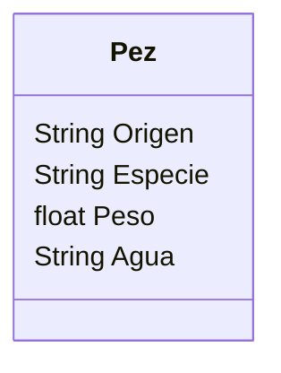

Un acuario quiere llevar un registro de los peces que tiene.
Necesitan registrar la especie, peso y origen.
Los peces pueden ser de agua dulce o salada.
Todos los peces son criados en cautiverio.
Antes de liberarlos se actualiza su peso y luego son liberados.
Obtener el Análisis de la clase

* Analisis de la clase
  Requisitos:
- Registrar peces
- Registrar los atributos de cada pez
- Actualizar su peso antes de liberarlos
- Liberar los peces
Objetos:
- Pez
Características:
- Pez
    - Origen
    - Especie
    - Peso
    - Agua

Acciones:
- (No hay acciones)
Ejercicio para ti (11)
Realizamos el diseño del diagrama de clase

3 minutos

Diseño del diagrama de clases
