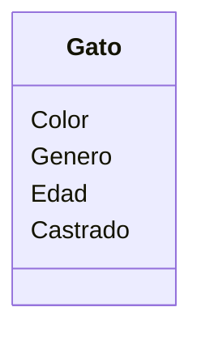
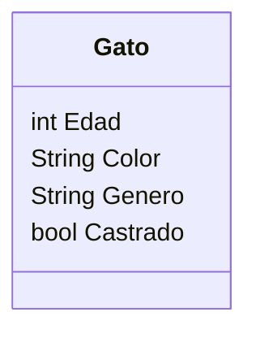

Un coleccionista de gatos los recolecta según sus
características. Las características que mas le importan
son el color, género, edad y si están castrados o no. 
El coleccionista registra los datos de cada gato 
que encuentra

Requisitos:
- Recolectar gatos
- Registrar los atributos de cada gato

Objetos:
- Gato

Características:
- Gato
    - Color
    - Género
    - Edad
    - Castrado

Acciones:
- (No hay acciones)

Definimos los atributos de la clase Gato
- Edad: Como un número entero
- Color: Como una cadena de texto
- Género: Como una cadena de texto
- Castrado: Como un sí o un no
 
Representamos los atributos con un tipo de dato
- Edad: int
- Color: String
- Género: String
- Castrado: bool

