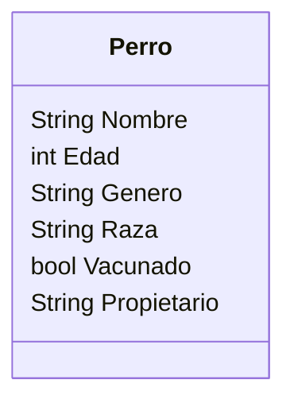

En un clinica veterinaria quieres registrar a los perros 
que llegan a consulta.
De cada perro se necesita registrar su nombre, edad, 
género, raza y si está vacunado ademas del nombre 
del propietario.

Analisis
Requisitos:
- Registrar perros
- Registrar los atributos de cada perro
Objetos:
- Perro
Características:
- Perro
    - Nombre
    - Edad
    - Género
    - Raza
    - Vacunado
    - Propietario
Acciones:
- (No hay acciones)

Diagrama de clases

programacion de clase
class Gato:
    pass

michi = Gato()
mau = Gato()

Agregar atributos a la instancia
michi = Gato()
michi.color = "naranja"
print(michi.color)